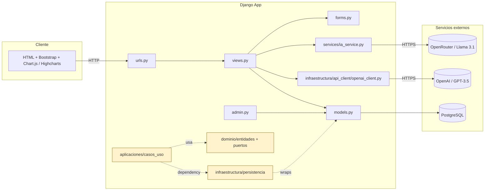
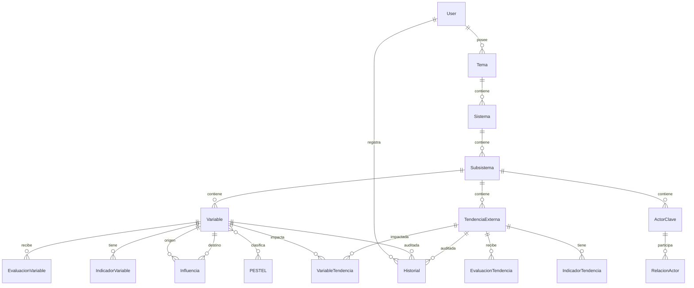
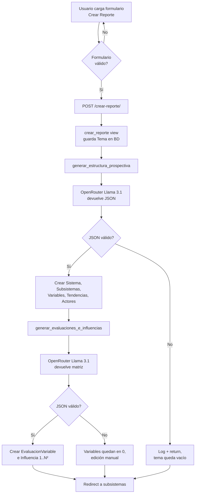
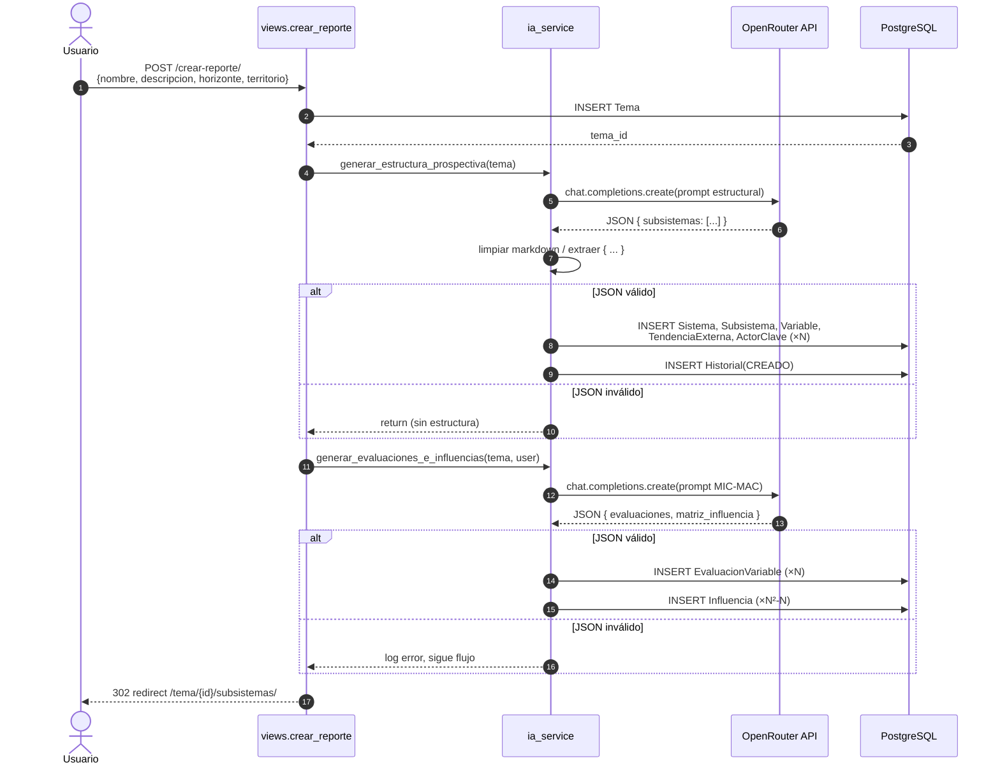
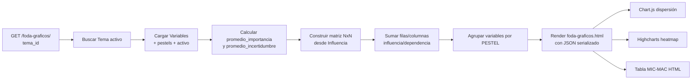
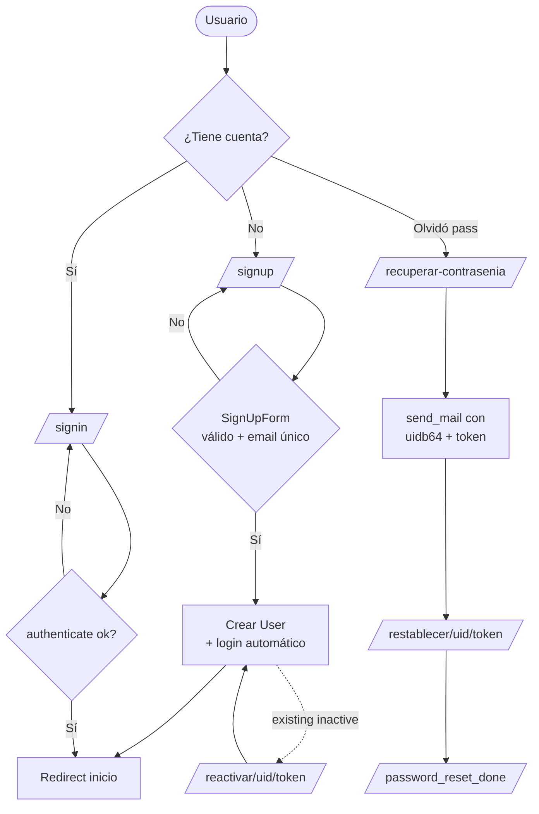

# Análisis del proyecto **HAAPAR_UNLa**

> Documento generado para la tesis de licenciatura. Resume normas de codificación, deuda técnica, componentes, cobertura del planteamiento del problema, diagramas y guía de ejecución/despliegue.

---

## 1. Visión general del proyecto

HAAPAR es una aplicación web Django que asiste a la cátedra de **Prospectiva Estratégica** (UCES) en la generación automatizada de estudios de futuro mediante IA. El usuario crea un *Tema* (con horizonte temporal y territorio) y la IA genera la estructura completa: subsistemas, variables, tendencias, actores y la matriz MIC-MAC de influencias. Posteriormente se permite edición manual por CRUD y visualización vía gráficos FODA / dispersión / heatmap.

### Stack actual

| Capa | Tecnología | Estado |
|------|------------|--------|
| Presentación | HTML + Bootstrap 5 + Chart.js + Highcharts | Implementado |
| Backend | Django 5.1 (vistas funcionales + ORM) | Implementado |
| Persistencia | PostgreSQL | Implementado |
| Integración IA | OpenRouter (`meta-llama/llama-3.1-8b-instruct`) y OpenAI SDK | Doble integración (ver §4) |
| API REST | Endpoint ad-hoc `JsonResponse` | **DRF anunciado pero no instalado** |
| Tests | `tests.py` vacío | **No existen** |

---

## 2. Arquitectura del repositorio

### 2.1 Estructura de carpetas

```
HAAPAR_UNLa/
├── manage.py
├── requirements.txt              ← solo django, python-dotenv, openai
├── roles.json                    ← fixture de permisos (30 KB, no se usa)
├── tools/test_chatgpt.py         ← script de prueba (vaciado)
├── haapar_unla/                  ← proyecto Django (settings, urls, wsgi/asgi)
│   ├── settings.py
│   └── urls.py
└── haapar_unla_app/              ← app principal
    ├── models.py                 ← 13 modelos en un único archivo
    ├── views.py                  ← 800 LOC con TODA la lógica HTTP
    ├── forms.py                  ← solo SignUpForm
    ├── admin.py                  ← registros básicos
    ├── apps.py
    ├── tests.py                  ← VACÍO
    ├── migrations/               ← 3 migraciones
    ├── templates/haapar_unla_app/
    ├── static/haapar_unla_app/assets/
    ├── services/ia_service.py    ← cliente IA (OpenRouter + Llama)
    ├── aplicaciones/             ← intento de Clean Architecture
    │   └── casos_uso/            ← 4 casos: registrar, iniciar/cerrar sesión, crear tema
    ├── dominio/                  ← entidades y puertos abstractos
    │   ├── entidades/            ← Tema, Usuario (POPOs)
    │   └── puertos/              ← entrada (servicios) + salida (repositorios)
    └── infraestructura/
        ├── api_client/openai_client.py  ← segundo cliente IA (OpenAI directo)
        ├── api_urls.py                  ← URL del endpoint ChatGPT
        └── persistencia/                ← repositorios DB para Tema y Usuario
```

### 2.2 Diagrama de componentes



> **Nota:** los componentes en amarillo (`dominio/`, `aplicaciones/casos_uso/`, `infraestructura/persistencia/`) están definidos pero **no son invocados** por `views.py`. Existe una capa hexagonal *iniciada pero abandonada*; la lógica real vive en las vistas.

### 2.3 Modelo de datos (entidad-relación simplificado)



---

## 3. Componentes principales y sus funciones

| Componente | Archivo | Función |
|------------|---------|---------|
| Configuración Django | `haapar_unla/settings.py` | Carga `.env`, define DB, middlewares, i18n (`es-AR`), templates, `LOGIN_URL`. |
| Ruteo global | `haapar_unla/urls.py` | Mapea ~30 rutas (auth, proyectos, variables, tendencias, actores, FODA, password reset). |
| Modelos de dominio | `haapar_unla_app/models.py` | 13 modelos: `Tema`, `Sistema`, `Subsistema`, `Variable`, `TendenciaExterna`, `ActorClave`, `RelacionActor`, `PESTEL`, `Influencia`, `EvaluacionVariable`, `EvaluacionTendencia`, `Historial`, `IndicadorVariable`, `IndicadorTendencia`, `VariableTendencia`. |
| Vistas | `views.py` | Todas las vistas funcionales: autenticación, perfil, CRUD de Temas/Variables/Tendencias/Actores/Subsistemas, FODA y endpoint `/api/chatgpt/`. |
| Servicio de IA | `services/ia_service.py` | Dos pipelines:<br/>• `generar_estructura_prospectiva(tema)` → genera subsistemas/variables/tendencias/actores.<br/>• `generar_evaluaciones_e_influencias(tema, user)` → genera matriz MIC-MAC + evaluaciones. |
| Cliente OpenAI alternativo | `infraestructura/api_client/openai_client.py` | Wrapper resiliente que prueba `openai<1.0`, `openai>=1.0` chat y Responses API. Usado solo por `chatgpt_api`. |
| Endpoint API | `infraestructura/api_urls.py` + `views.chatgpt_api` | `POST /api/chatgpt/` recibe `{prompt}`, devuelve `{success, text}`. **Sin auth, `csrf_exempt`.** |
| Casos de uso (parciales) | `aplicaciones/casos_uso/*.py` | `RegistrarUsuario`, `IniciarSesion`, `CerrarSesion`, `CrearTema`. **No se usan en runtime.** |
| Repositorios DB | `infraestructura/persistencia/*.py` | `TemaRepositorioDB`, `UsuarioRepositorioDB`. **No se usan en runtime.** |
| Admin | `admin.py` | Registros con `list_display` y filtros para 11 modelos. |
| Templates | `templates/haapar_unla_app/` | 22 plantillas (Bootstrap 5). `base.html` define sidebar, dropdown de usuario y modo oscuro. |
| Assets estáticos | `static/haapar_unla_app/assets/` | CSS, JS, imágenes (logo). |

---

## 4. Buenas prácticas detectadas

1. **Variables sensibles vía `.env`** (`python-dotenv`): credenciales DB y `OPENAI_API_KEY` salen del settings.
2. **`.gitignore` correcto** ignora `.env`, `__pycache__/`, `db.sqlite3`, `.idea/`, `.vscode/`.
3. **Soft delete** consistente con `activo: BooleanField(default=True)` en `Tema`, `Subsistema`, `Variable`, `TendenciaExterna`, `ActorClave`. Permite auditoría sin borrado físico.
4. **Auditoría automática** mediante el modelo `Historial` con tipos de acción (`CREADO`, `MODIFICADO`, `ELIMINADO`, `EVALUACION`).
5. **`unique_together`** sobre `EvaluacionVariable` y `EvaluacionTendencia` evita evaluaciones duplicadas por (variable, usuario).
6. **Decoradores `@login_required`** en todas las vistas que manejan datos de usuario.
7. **Páginas de error personalizadas** (`400`, `403`, `404`, `500`) registradas con `handler*`.
8. **Recuperación de contraseña** completa con tokens (`default_token_generator`) y reactivación de cuentas dadas de baja.
9. **Internacionalización**: `LANGUAGE_CODE = 'es-AR'`, `TIME_ZONE = 'America/Argentina/Buenos_Aires'`, `USE_TZ = True`.
10. **Validación defensiva del JSON de la IA**: limpieza de fences markdown, recorte por `{ ... }`, manejo de `JSONDecodeError`.
11. **Uso de `prefetch_related` / `select_related`** en `subsistemas` e `historial_variables` para evitar N+1.
12. **Esquema CSS centralizado** en `assets/css/main.css` y plantilla `base.html` con bloques `messages` y `content`.

---

## 5. Deuda técnica y áreas excesivamente complicadas

### 5.1 Seguridad (crítico)

| Problema | Ubicación | Riesgo |
|----------|-----------|--------|
| `SECRET_KEY` **hardcodeado** en repo | `settings.py:26` | Compromiso de sesiones, CSRF y firmas. |
| `DEBUG = True` por defecto | `settings.py:29` | Stack traces y settings expuestos en producción. |
| `ALLOWED_HOSTS = ['*']` | `settings.py:31` | Permite Host-Header attacks. |
| `chatgpt_api` con `@csrf_exempt` y sin `@login_required` | `views.py:641-658` | Endpoint público que consume costos de IA del proyecto. |
| `print(api_key)` en `ia_service.py:28` | Servicios | Filtra la clave de IA en logs. |
| `print(f"DEBUG: Password en BD ...")` | `usuario_repositorio_db.py:59-61` | Filtra hashes de password. |
| `SetPasswordForm` sin recoger campo del formulario en `reactivar_cuenta` | `views.py:309` | Acepta `first_name`/`last_name` por POST sin validación. |
| `eliminar_variable` se ejecuta por GET (no usa `@require_POST`) | `views.py:185-198` | CSRF accidental, idempotencia rota. |
| Email del reset hardcodeado a `'admin@example.com'` | `views.py:602` | El header `From` no coincide con `DEFAULT_FROM_EMAIL`. |

### 5.2 Arquitectura inconsistente

- **Clean Architecture abandonada**: `dominio/`, `aplicaciones/casos_uso/`, `infraestructura/persistencia/` están definidos pero `views.py` consume `models.py` directamente. Hay duplicidad de responsabilidades (ej. `RegistrarUsuario` use-case vs `SignUpForm`).
- **Doble cliente de IA divergente**:
    - `services/ia_service.py` → OpenRouter + `meta-llama/llama-3.1-8b-instruct` (carga `API_KEY_OPENROUTER`).
    - `infraestructura/api_client/openai_client.py` → OpenAI + `gpt-3.5-turbo` (carga `OPENAI_API_KEY`).
      El README documenta solo el segundo; el flujo principal usa el primero. Confunde la configuración.
- **`models.py` monolítico** (8 KB, 13 clases). Mezcla agregados (`Tema/Sistema/Subsistema`), métricas (`Evaluacion*`), relaciones (`Influencia`, `VariableTendencia`) y auditoría (`Historial`). Conviene partir en módulos por bounded context.
- **`views.py` monolítico** (~800 LOC, 28 KB). Mezcla auth, CRUD de 5 entidades distintas, FODA, recuperación de contraseña y endpoint API. Dos definiciones duplicadas de `error_400_view`/`error_403_view`/`error_404_view`/`error_500_view` (líneas 391-401 y 783-799).

### 5.3 Bugs latentes

| Bug | Ubicación | Detalle |
|-----|-----------|---------|
| Rama muerta en `tendencia_detalle` | `views.py:507-513` | `TendenciaExterna.objects.filter(tema=tema)` falla porque `TendenciaExterna` no tiene FK directa a `Tema`. La rama se ejecuta solo si `tema_id` (kwarg) está presente, pero ninguna URL lo pasa. |
| Atributo `tema_id` ausente en URL `tendencia_detalle` | `urls.py:59` | Solo recibe `subsistema_id`, no `tema_id`; la rama anterior nunca se activa pero queda como falsa funcionalidad. |
| Validación `validar()` redundante | `dominio/entidades/tema.py:22-29` | `if not self.nombre or not self.horizonte` y luego `if not self.horizonte` repetido. |
| Eliminar subsistema sin verificación de método | `views.py:251-257` | Cualquier GET a la URL desactiva el registro si llegara con el flag (la guarda mira `request.method == 'POST'` pero igualmente redirige). |
| `Influencia.valor` usa `DecimalField(5,2)` pero la IA devuelve enteros 0-3 | `models.py:113` / `ia_service.py:267-270` | Sobreingenierizado; basta `IntegerField`. |
| `roles.json` con BOM/UTF-16 | raíz | El archivo está codificado en UTF-16 con BOM, no se carga como fixture estándar. |
| `tests.py` vacío | `haapar_unla_app/tests.py` | Cero tests automatizados. |
| `SignUpForm` valida email único pero el flujo de registro crea otra consulta paralela | `views.py:268-294` + `forms.py:46-53` | Hay dos validaciones de email/username; pueden divergir. |

### 5.4 Calidad y mantenibilidad

- **Vistas muertas**: `about`, `blog`, `blog_details`, `contact`, `services`, `service_details`, `team`, `portfolio`, `portfolio_details`, `starter_page` (líneas 742-779) sin URL ni template. Son restos de plantilla externa.
- **Mezcla de idiomas**: `id_tema`/`id_subsistema` en español, `User`/`SignUpForm` en inglés.
- **`requirements.txt`** sin versiones fijas (`django>=5.1.6`). Falta `psycopg2-binary` y `requests` (necesarios en runtime).
- **Sin paginación** en `listar_proyectos`, `historial_variables`, `tendencias.html`. Se rompe con datos reales.
- **Cantidad de filas de `Influencia`** crece como N² por proyecto (16 variables → 256 registros). Sin índice compuesto sobre `(variable_origen, variable_destino)`.
- **Cálculo de productos** (matrices, índices) se realiza solo al renderizar `foda_graficos`. No se recalculan al editar variables; viola el requisito *"todos los productos deberán calcularse tras cualquier cambio"*.
- **No hay logging estructurado**: solo `print()`.
- **No hay manejo de timeouts/retries** en llamadas a IA. Una caída de la API rompe el flujo `crear_reporte`.
- **Codificación CRLF / mezcla LF** y archivos con BOM (`roles.json`).

---

## 6. Cobertura del *Planteamiento del problema*

> *"Desarrollar un sistema web Django que automatice la carga y gestión de tablas mediante la integración con la API de Chat GPT. Cada tabla deberá tener una interfaz para realizar CRUD a mano. Todos los productos deberán calcularse tras cualquier cambio."*

| Requisito | Estado | Evidencia / faltante |
|-----------|--------|----------------------|
| Sistema web en Django | ✅ Completo | `haapar_unla/`, urls, vistas, templates. |
| Integración con ChatGPT | ⚠️ Parcial | Hay 2 clientes pero el flujo principal usa **OpenRouter+Llama**, no ChatGPT. El endpoint `/api/chatgpt/` documentado en README usa OpenAI pero está aislado. |
| Carga automática de tablas | ✅ Completo | `generar_estructura_prospectiva` genera 4 subsistemas × (4 vars + 3 actores + 3 tendencias). |
| Generación automática de la matriz MIC-MAC | ✅ Completo | `generar_evaluaciones_e_influencias`. |
| CRUD manual sobre cada tabla | ⚠️ Parcial | CRUD para Variables, Tendencias, Actores, Subsistemas. **Falta**: CRUD de Indicadores, PESTEL, VariableTendencia, Influencia (no hay UI para editar la matriz). |
| Cálculo automático de productos tras cualquier cambio | ❌ No cumple | Las evaluaciones promedio se calculan al consultarlas, pero la matriz MIC-MAC indirecta, totales de influencia/dependencia y datos de PESTEL **solo se computan en `foda_graficos`**, sin recálculo al editar. La IA no se reinvoca. |
| API REST con DRF | ❌ No cumple | DRF no está instalado; solo existe un endpoint manual `JsonResponse`. |
| Bootstrap + responsive | ✅ Completo | Bootstrap 5, sidebar colapsable. |
| PostgreSQL | ✅ Configurado | settings.py usa `django.db.backends.postgresql`. |

### 6.1 Brechas de cobertura priorizadas

1. **Recalcular productos al editar** (alto impacto, requisito explícito).
2. **CRUD sobre la matriz de influencia** (componente central de prospectiva).
3. **Unificar el cliente de IA** y resolver "ChatGPT vs OpenRouter".
4. **Implementar Django REST Framework** como prometía el README.
5. **Suite de tests** mínima (modelos, parsing JSON de la IA, vistas críticas).

---

## 7. Diagramas

### 7.1 Flujo: creación de un nuevo proyecto



### 7.2 Secuencia: integración con la IA



### 7.3 Flujo: visualización FODA / MIC-MAC



### 7.4 Flujo: autenticación y recuperación



---

## 8. Recomendaciones priorizadas de mejora

### Bloque 1 — Seguridad (resolver antes de cualquier demo pública)

1. Mover `SECRET_KEY` al `.env` y rotar la actual (ya está expuesta en git history).
2. `DEBUG = os.getenv("DJANGO_DEBUG", "False") == "True"` y `ALLOWED_HOSTS` desde env separados por coma.
3. Aplicar `@login_required` y `@require_POST` al endpoint `chatgpt_api`. Eliminar `csrf_exempt` o reemplazar por token de servicio.
4. Eliminar `print(api_key)` y `print("DEBUG: Password ...")`. Reemplazar por `logging` con nivel `INFO`/`DEBUG` configurable.
5. Cambiar `eliminar_variable` y `eliminar_actor` a `@require_POST`.

### Bloque 2 — Coherencia arquitectónica

6. **Decisión binaria**: o se completa la arquitectura hexagonal (vistas → casos de uso → repositorios) o se elimina. Hoy es código muerto que confunde.
7. Unificar el cliente de IA en un único módulo (`services/ai/`) con interfaz inyectable; permitir conmutar proveedor por env (`AI_PROVIDER=openrouter|openai`).
8. Partir `views.py` por bounded context (`views/auth.py`, `views/proyectos.py`, `views/variables.py`, `views/tendencias.py`, `views/actores.py`, `views/foda.py`, `views/api.py`).
9. Partir `models.py` análogamente bajo `models/`.
10. Eliminar las vistas muertas (`about`, `blog`, `team`, etc.) y los duplicados de `error_*_view`.

### Bloque 3 — Cumplimiento del planteamiento del problema

11. **Recálculo de productos**: implementar `signals` (`post_save`/`post_delete`) sobre `Variable`, `Influencia`, `EvaluacionVariable` que invaliden caché y, si se desea, dispare un *job* de recomputación.
12. Agregar UI de edición manual de la matriz de influencia y de PESTEL (faltan dos requisitos del enunciado).
13. Instalar Django REST Framework + autenticación por token; exponer endpoints `/api/temas/`, `/api/variables/`, `/api/foda/<tema_id>/`. Sustituye al endpoint manual.

### Bloque 4 — Robustez

14. `requirements.txt` con versiones pinneadas y agregar `psycopg2-binary`, `djangorestframework`, `gunicorn`, `whitenoise` (para servir static en prod).
15. Manejar timeouts/retries (`tenacity` o `httpx`) para llamadas a la IA. Persistir el `prompt`/`response` para auditar costos.
16. Crear suite de tests:
    - `tests/test_ia_service.py`: parser de JSON con respuestas reales y degradadas.
    - `tests/test_models.py`: `unique_together`, `promedio_*`.
    - `tests/test_views.py`: smoke de cada vista crítica con `Client`.
17. Agregar paginación (`Paginator`) en listados.
18. Corregir `tendencia_detalle` (rama muerta) y eliminar `roles.json` o convertirlo a fixture válida.
19. Crear índices: `Influencia(variable_origen, variable_destino)`, `EvaluacionVariable(variable, fecha)`, `Historial(fecha)`.

### Bloque 5 — Calidad

20. Agregar `pre-commit` con `ruff`, `black`, `isort`, `django-upgrade`.
21. Adoptar `python-decouple` o `django-environ` (más explícito que `dotenv` puro).
22. Estandarizar nombres de URL en `kebab-case` (hoy hay mezcla `/crear-reporte/` y `/proyectos/`).
23. Configurar logging estructurado (`LOGGING` en settings).
24. Configurar `SECURE_SSL_REDIRECT`, `SESSION_COOKIE_SECURE`, `CSRF_COOKIE_SECURE` en producción.

---

## 9. Resumen ejecutivo para la tesis

- **El proyecto cumple ~70 % del planteamiento del problema.** Faltan: recálculo automático de productos, CRUD sobre la matriz de influencia, DRF, y unificación del proveedor de IA.
- **La arquitectura más visible (Clean/Hexagonal) está empezada y abandonada**: convivir esto con vistas funcionales monolíticas es la mayor fuente de deuda técnica para un trabajo académico.
- **Riesgos de seguridad bloqueantes** para una demo pública: `SECRET_KEY` en el repo, `DEBUG=True`, endpoint IA sin autenticar, `print` de credenciales.
- **Bases sólidas** existentes: modelo de datos rico y consistente, soft-delete, auditoría con `Historial`, recuperación de contraseña, integración real con LLM y visualizaciones (Chart.js + Highcharts).
- **Próximos pasos sugeridos para llegar a defensa**: aplicar el Bloque 1 (seguridad) + Bloque 3 (cobertura del enunciado) + tests mínimos + dockerización. Con eso el proyecto pasa de prototipo académico a entregable defendible.
